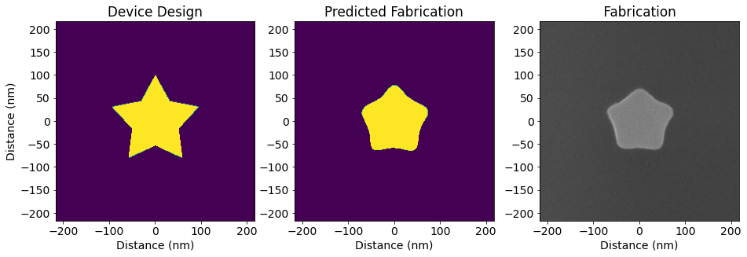

# PreFab
`PreFab` (Prediction of Fabrication) is used for modelling fabrication process induced variations in integrated photonic devices using deep convolutional neural networks.

Trained models predict variations such as corner rounding (both over and under etching), washing away of small lines and islands, and filling of narrow holes and channels in planar photonic structures. Once predicted, the designer resimulates their design to rapidly prototype the expected performance and make any necessary changes prior to (costly) fabrication.

This repository includes the tools used in the paper `Deep Learning Based Prediction of Fabrication-Process-Induced Structural Variations in Nanophotonic Devices` (which can be viewed [here](https://pubs.acs.org/doi/10.1021/acsphotonics.1c01973)).

*Figure 1 - Predicted fabrication variation of a simple star structure on a 220 nm silicon-on-insulator electron-beam lithography process. Prediction time of 8.2 seconds.*

## Authors
`PreFab` was written by Dusan Gostimirovic with Odile Liboiron-Ladouceur, Danxia Xu, and Yuri Grinberg.

## Usage and Citation
For usage of `PreFab` in your work, please cite our [journal article](https://pubs.acs.org/doi/10.1021/acsphotonics.1c01973).

## License
This project is licensed under the terms of the MIT license. © 2022 National Research Council Canada and McGill University.
